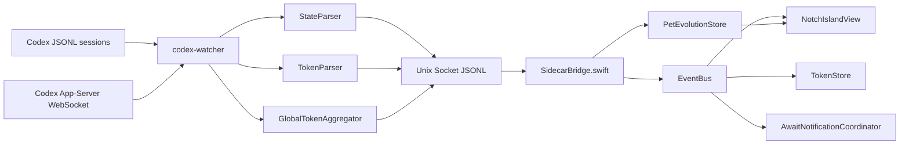

# 09 — 阶段一集成测试与 Debug 指南

> 目标：把 Rust sidecar、Unix Socket IPC、Swift EventBus 和 Notch UI 串成可启动、可验证、可调试的阶段一闭环。

---

## 实现状态

✅ 已实现并通过本地验证。

当前 09 只完成阶段一集成，不进入 10+ 记忆系统：

- Rust sidecar 将 `SessionStateEvent`、`TokenSnapshot` 和脱敏后的 `RawEvent` 通过 Unix Socket 广播
- Rust sidecar 将所有 sessions 的最新 token totals 聚合为 `global_token_usage`
- Swift App 启动时自动拉起 bundled `codex-watcher`
- Swift App 设置 `CODEX_ISLAND_SOCKET`，连接 Unix Socket，读取 JSONL 帧
- Swift App 解码状态事件、当前会话 Token 快照和全局 Token 快照，并在 `MainActor` 上写入 `EventBus` / `PetEvolutionStore`
- Xcode build 后自动编译并拷贝 Rust sidecar 到 `.app/Contents/Resources/codex-watcher`
- `make verify` 覆盖 Rust 单测、IPC 冒烟测试和 macOS Debug 构建
- `make test-app-runtime` 启动真实 Debug App，用临时 Codex sessions 验证 Swift `EventBus`、窗口和退出清理
- App 退出时同步终止 sidecar，并清理 socket，避免残留进程

当前未实现：

- 10+ 记忆系统
- Sparkle 更新、发布签名、公证、DMG 打包
- 自动化真实 Codex 端到端场景回放；真实 Codex 写入 sessions 时仍需手动复验

---

## 集成链路



说明：

- JSONL 是主路径，WebSocket 是辅助路径，不可用时静默降级
- IPC 一行一个 JSON 对象
- Swift 消费状态事件、当前会话 Token 快照和全局 Token 快照，其他原始事件暂时忽略
- 阶段一保持只读 Codex sessions，不写入 Codex 文件

---

## 关键文件

| 文件 | 说明 |
|------|------|
| [main.rs](/Applications/APP/Codex-Island/codex-watcher/src/main.rs) | 启动 watcher/parser/IPC，并广播状态、Token、原始脱敏事件 |
| [global_token_usage.rs](/Applications/APP/Codex-Island/codex-watcher/src/parser/global_token_usage.rs) | 扫描历史 sessions 并维护全局 token 累计 |
| [unix_socket.rs](/Applications/APP/Codex-Island/codex-watcher/src/ipc/unix_socket.rs) | Unix Socket 服务端，一行一个 JSON 推送给客户端 |
| [SidecarBridge.swift](/Applications/APP/Codex-Island/CodexIsland/DataLayer/SidecarBridge.swift) | Swift 端 sidecar 生命周期、socket 连接、事件解码与 EventBus 分发 |
| [PetEvolutionStore.swift](/Applications/APP/Codex-Island/CodexIsland/Core/PetEvolutionStore.swift) | 使用历史全局 token 累计和后续增量驱动宠物进食、等级和变形阶段 |
| [AppDelegate.swift](/Applications/APP/Codex-Island/CodexIsland/App/AppDelegate.swift) | App 启停时启动/停止 SidecarBridge，并注册 Debug 观察日志 |
| [project.yml](/Applications/APP/Codex-Island/project.yml) | XcodeGen 配置，post-build 编译并拷贝 Rust sidecar |
| [Makefile](/Applications/APP/Codex-Island/Makefile) | `verify` 串联 Rust 测试、IPC smoke test、macOS build；`test-app-runtime` 启动 App 运行验证 |
| [ipc_smoke_test.py](/Applications/APP/Codex-Island/scripts/ipc_smoke_test.py) | 构造临时 Codex sessions，验证 IPC 输出状态序列和 Token 快照 |
| [app_runtime_smoke_test.py](/Applications/APP/Codex-Island/scripts/app_runtime_smoke_test.py) | 启动真实 Debug App，验证 Swift 状态、Token 日志、窗口和退出清理 |

---

## IPC 消息

### 状态事件

```json
{"session_id":"smoke-session","state":"awaiting_input","timestamp":"2026-06-28T08:00:00Z","await_reason":{"type":"tool_approval","tool":"shell","command":"echo smoke"}}
```

Swift 解码为 `SessionStateEvent`，随后调用：

```swift
EventBus.shared.handleStateEvent(event)
```

### Token 快照

```json
{"session_id":"smoke-session","session_file":"/tmp/rollout-smoke.jsonl","delta_input":120,"delta_cached_input":40,"delta_uncached_input":80,"delta_output":12,"delta_reasoning":0,"total_input":120,"total_cached_input":40,"total_uncached_input":80,"total_output":12,"total_reasoning":0,"cache_hit_rate":0.3333333333,"timestamp":"2026-06-28T08:00:00Z","turn_index":1}
```

Swift 解码为 `TokenSnapshot`，随后调用：

```swift
EventBus.shared.handleTokenSnapshot(snapshot)
```

### 全局 Token 快照

```json
{"type":"global_token_usage","total_input":300,"total_cached_input":140,"total_output":37,"total_reasoning":3,"total_tokens":337,"session_count":2,"updated_at":"2026-06-28T08:00:00Z"}
```

Swift 解码为 `GlobalTokenUsageSnapshot`，随后调用：

```swift
PetEvolutionStore.shared.update(with: snapshot)
```

`TokenStore` 继续展示当前 active session；`PetEvolutionStore` 首次导入历史全局累计 token，之后根据正向增量继续计算宠物成长等级。

---

## 构建集成

Xcode Debug build 会执行 post-build script：

```bash
cd "$PROJECT_DIR/codex-watcher"
cargo build
mkdir -p "$TARGET_BUILD_DIR/$UNLOCALIZED_RESOURCES_FOLDER_PATH"
cp "$PROJECT_DIR/codex-watcher/target/debug/codex-watcher" \
  "$TARGET_BUILD_DIR/$UNLOCALIZED_RESOURCES_FOLDER_PATH/codex-watcher"
chmod +x "$TARGET_BUILD_DIR/$UNLOCALIZED_RESOURCES_FOLDER_PATH/codex-watcher"
```

Swift 启动时优先使用 bundled resource：

```swift
Bundle.main.url(forResource: "codex-watcher", withExtension: nil)
```

如果本地调试时没有 bundled binary，则回退到：

```text
/Applications/APP/Codex-Island/codex-watcher/target/debug/codex-watcher
```

---

## 验证结果

已执行：

```bash
xcodegen generate
(cd codex-watcher && cargo test)
python3 scripts/ipc_smoke_test.py codex-watcher/target/debug/codex-watcher
make build-macos
python3 scripts/app_runtime_smoke_test.py
```

结果：

- Rust 单测：39 passed
- IPC smoke test：通过，状态序列包含 `thinking` / `streaming` / `idle` / `awaiting_input` / `error`
- Token 快照：验证 `IN:120 CACHE:40 OUT:12` 和 `IN:220 CACHE:120 OUT:30`
- 全局 Token 快照：验证启动 replay 为 0，两个 session 聚合为 `total_tokens=337`
- macOS Debug build：`BUILD SUCCEEDED`
- Xcode post-build：`codex-watcher` 已拷贝到 `.app/Contents/Resources/`

已执行 App 运行检查：

- `CodexIsland.app` 能正常启动
- bundled `codex-watcher` 能随 App 启动
- Swift `EventBus` 收到 `thinking=3`、`streaming=2`、`awaiting_input=2`、`error=1`、`idle=4`
- socket 创建于当前用户临时目录，例如：

```text
/var/folders/.../T/codex-island-501.sock
```

- 无刘海/当前屏幕环境下窗口降级为顶部居中浮动胶囊，默认常驻 pill bounds：

```text
Width = 440
Height = 34
X = 620
Y = 18
Top inset = 18
```

- 退出 App 后 `CodexIsland` 和 `codex-watcher` 均无残留进程
- 退出 App 后 socket 已清理

---

## Debug 日志

Swift DEBUG 构建会打印 EventBus 状态：

```swift
EventBus.shared.$sessionState
    .sink { state in
        print("[EventBus] state -> \(state.rawValue)")
    }
```

Token 快照会打印累计输入、缓存输入和输出：

```swift
EventBus.shared.$latestToken
    .compactMap { $0 }
    .sink { snapshot in
        print("[Token] IN:\(snapshot.totalInput) CACHE:\(snapshot.totalCachedInput) OUT:\(snapshot.totalOutput)")
    }
```

Rust 日志可通过环境变量控制：

```bash
RUST_LOG=debug ./codex-watcher
RUST_LOG=info ./codex-watcher
RUST_LOG=error ./codex-watcher
```

Xcode 启动 App 时会继承当前环境；如果父进程设置了 `RUST_LOG`，`SidecarBridge` 会保留该值，否则使用 `info`。

---

## 手动真实场景复验

09 的自动化 smoke test 使用临时 `CODEX_HOME`，证明了 sidecar、socket、Swift 数据模型和构建链路可用。真实 Codex 工作流还需要在本机用实际 Codex sessions 复验：

1. 启动 Debug App
2. 在 Codex 中输入一个普通任务
3. 确认 UI 进入 `thinking`，随后 `streaming`
4. 输入一个需要工具审批的任务
5. 确认 UI 进入 `awaiting_input`，触发系统通知和红色等待态
6. 审批后确认 UI 回到 `thinking` / `streaming` / `idle`

真实复验时如果 UI 没变化，按以下顺序排查：

```bash
# 1. sessions 是否有新增 JSONL
find ~/.codex/sessions -name 'rollout-*.jsonl' -print | tail

# 2. JSONL 是否出现 token 或等待事件
grep -i 'token_count\|await\|approval' ~/.codex/sessions/*/*/*/*.jsonl | tail -20

# 3. App 是否拉起 sidecar
pgrep -fl 'CodexIsland|codex-watcher'

# 4. sidecar 是否监听 socket
lsof -a -c codex-watcher -U
```

---

## 阶段一剩余复验

09 完成后，阶段一代码链路已经打通。进入阶段二前仍建议补做：

- 带刘海 Mac 真机定位复验
- 真实 Codex 长会话 Token 误差复验
- 真实工具审批通知防刷屏复验
- Instruments 内存、CPU、主线程卡顿检查
- 发布前签名、公证、DMG 打包验证
